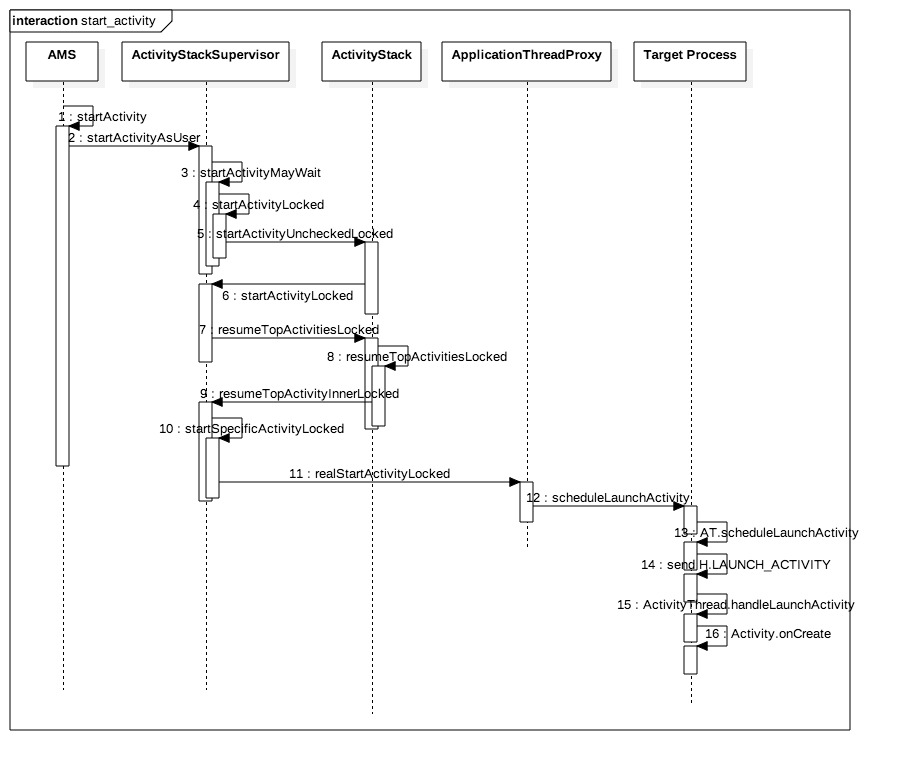
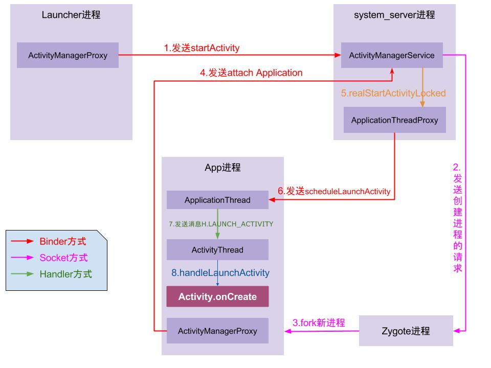

1. ContextImpl：Context Api的真正实现，其他Context调用方法基本上都依赖于ContextImpl的实现（此处要注意并不是所有Context的子类的方法都是ContextImpl实现的, 比如Activity的startActivity就是自己实现的）

2. 所有的startActivity最终都走到了【Instrumentation】ActivityThread.mInstrumentation的execStartActivity
3. hook全局的startActivity

```kotlin
class ProxyInstrumentation(val instrumentationProxy: Instrumentation) : Instrumentation() {

    companion object {
        val TAG = "ProxyInstrumentation"

        @JvmStatic
        fun hook() {
            // ActivityThread.class
            val threadClass = Class.forName("android.app.ActivityThread")

            // ActivityThread#mInstrumentation
            val instrumentationField = threadClass.getDeclaredField("mInstrumentation")
            instrumentationField.isAccessible = true

            // ActivityThread.currentActivityThread get ActivityThread instance
            val currentThreadMethod = threadClass.getDeclaredMethod("currentActivityThread")
            currentThreadMethod.isAccessible = true

            // 获取真实的Instrumentation对象
            val thread = currentThreadMethod.invoke(null)
            val instrumentation: Instrumentation = instrumentationField.get(thread) as Instrumentation

            // 设置代理
            val proxy = ProxyInstrumentation(instrumentation)
            instrumentationField.set(thread, proxy)
        }
    }

    @SuppressLint("DiscouragedPrivateApi")
    fun execStartActivity(
        who: Context?, contextThread: IBinder?, token: IBinder?, target: Activity,
        intent: Intent, requestCode: Int, options: Bundle?
    ): ActivityResult? {
        try {
            val execStartActivity =
                Instrumentation::class.java.getDeclaredMethod(
                    "execStartActivity",
                    Context::class.java,
                    IBinder::class.java,
                    IBinder::class.java,
                    Activity::class.java,
                    Intent::class.java,
                    Int::class.javaPrimitiveType,
                    Bundle::class.java
                )
            val stack_printer = Throwable("stack printer")
            Log.d(
                TAG,
                target.toString() + "call start Activity === " + intent,
                stack_printer
            )
            return execStartActivity.invoke(
                instrumentationProxy,
                who,
                contextThread,
                token,
                target,
                intent,
                requestCode,
                options
            ) as ActivityResult?
        } catch (e: Exception) {
            e.printStackTrace()
        }
        return null
    }

}
```


4. ```kotlin
    implementation 'com.google.dexmaker:dexmaker:1.2'
   
   import android.annotation.SuppressLint
   import android.app.Activity
   import android.app.Instrumentation
   import android.content.Context
   import android.content.Intent
   import android.util.Log
   import java.lang.reflect.InvocationHandler
   
   /**
    * @Description: //DexMaker
    * @Date 2020/9/16 8:26 PM
    * @Author wzx
    * @Email wzx@meitu.com
    */
   object ProxyInstrumentationWithDexMaker {
   
       val TAG = "ProxyInstrumentation"
   
       @SuppressLint("DiscouragedPrivateApi", "PrivateApi")
       @Suppress("NAME_SHADOWING")
       @JvmStatic
       fun hook(context: Context?) {
           try {
               System.setProperty("dexmaker.dexcache", context?.cacheDir.toString())
               //获取mInstrumentation
               val mThread = Class.forName("android.app.ActivityThread")
               val mInstrumentation = mThread.getDeclaredField("mInstrumentation")
               mInstrumentation.isAccessible = true
   
               //获取 ActivityThread 对象
               val method = mThread.getDeclaredMethod("currentActivityThread")
               method.isAccessible = true
               val o = method.invoke(mThread)
               val instrumentation = mInstrumentation.get(o) as Instrumentation
   
               val proxyInstrumentation = HookDynamicHandler.create(
                   instrumentation,
                   InvocationHandler { proxy, method, args ->
                       val invoke = method.invoke(proxy, *args)
                       if (method.name.startsWith("execStartActivity")) {
                           val stringifyParams = getStringifyParams(args)
                           val stackPrinter = Throwable("stack_printer")
                           Log.d(TAG, stringifyParams, stackPrinter)
                       }
                       invoke
                   })
               //设置
               mInstrumentation.set(o, proxyInstrumentation)
               Log.e(TAG, "hook: success ...!!")
           } catch (e: Exception) {
               e.printStackTrace()
           }
       }
   
       @JvmStatic
       private fun getStringifyParams(args: Array<Any>?): String {
           val sb = StringBuilder()
           if (args != null) {
               for (arg in args) {
                   if (arg is Context && arg !is Activity) {
                       sb.append(arg.javaClass.name)
                       sb.append(" Call ")
                   }
                   if (arg is Intent) {
                       sb.append(arg.toString())
                   }
               }
           }
           return sb.toString()
       }
   }
   ```


startActivity:


ActivityManager



通过Lancher

- 


- `线程1`的AMS中调用`线程2`的ATP来发送事件；（由于同一个进程的线程间资源共享，可以相互直接调用）
- `线程2`通过binder将暂停Activity的事件传输到App进程的`线程4`；
- `线程4`通过handler消息机制，将暂停Activity的消息发送给`主线程`；
- `主线程`在looper.loop()中循环遍历消息，当收到暂停Activity的消息(`PAUSE_ACTIVITY`)时，便将消息分发给ActivityThread.H.handleMessage()方法，再经过方法的层层调用，最后便会调用到Activity.onPause()方法。


reference： 

http://gityuan.com/2016/03/12/start-activity/

https://yuanfentiank789.github.io/2016/03/12/start-activity/