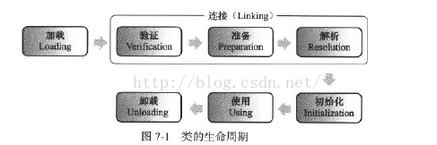

https://blog.csdn.net/zhangliangzi/article/details/51319033


1、什么是类加载？什么时候进行类加载？

2、什么是类初始化？什么时候进行类初始化？

3、什么时候会为变量分配内存？

4、什么时候会为变量赋默认初值？什么时候会为变量赋程序设定的初值？

5、类加载器是什么？

6、如何编写一个自定义的类加载器？


首先，在代码编译后，就会生成JVM（Java虚拟机）能够识别的二进制字节流文件（*.class）。而JVM把Class文件中的类描述数据从文件加载到内存，并对数据进行校验、转换解析、初始化，使这些数据最终成为可以被JVM直接使用的Java类型，这个说来简单但实际复杂的过程叫做JVM的类加载机制。


Class文件中的“类”从加载到JVM内存中，到卸载出内存过程有七个生命周期阶段。类加载机制包括了前五个阶段。

如下图所示：



其中，加载、验证、准备、初始化、卸载的开始顺序是确定的，注意，只是按顺序开始，进行与结束的顺序并不一定。解析阶段可能在初始化之后开始。


另外，类加载无需等到程序中“首次使用”的时候才开始，JVM预先加载某些类也是被允许的。（类加载的时机）


###一、类的加载

我们平常说的加载大多不是指的类加载机制，只是类加载机制中的第一步加载。在这个阶段，JVM主要完成三件事：


1、通过一个类的全限定名（包名与类名）来获取定义此类的二进制字节流（Class文件）。而获取的方式，可以通过jar包、war包、网络中获取、JSP文件生成等方式。

2、将这个字节流所代表的静态存储结构转化为方法区的运行时数据结构。这里只是转化了数据结构，并未合并数据。（方法区就是用来存放已被加载的类信息，常量，静态变量，编译后的代码的运行时内存区域）

3、在内存中生成一个代表这个类的java.lang.Class对象，作为方法区这个类的各种数据的访问入口。这个Class对象并没有规定是在Java堆内存中，它比较特殊，虽为对象，但存放在方法区中。


###二、类的连接

类的加载过程后生成了类的java.lang.Class对象，接着会进入连接阶段，连接阶段负责将类的二进制数据合并入JRE（Java运行时环境）中。类的连接大致分三个阶段。

1、验证：验证被加载后的类是否有正确的结构，类数据是否会符合虚拟机的要求，确保不会危害虚拟机安全。

2、准备：为类的静态变量（static filed）在方法区分配内存，并赋默认初值（0值或null值）。如static int a = 100;

静态变量a就会在准备阶段被赋默认值0。

对于一般的成员变量是在类实例化时候，随对象一起分配在堆内存中。

另外，静态常量（static final filed）会在准备阶段赋程序设定的初值，如static final int a = 666;  静态常量a就会在准备阶段被直接赋值为666，对于静态变量，这个操作是在初始化阶段进行的。

3、解析：将类的二进制数据中的符号引用换为直接引用。


###三、类的初始化

类初始化是类加载的最后一步，除了加载阶段，用户可以通过自定义的类加载器参与，其他阶段都完全由虚拟机主导和控制。到了初始化阶段才真正执行Java代码。

类的初始化的主要工作是为静态变量赋程序设定的初值。

如static int a = 100;在准备阶段，a被赋默认值0，在初始化阶段就会被赋值为100。


Java虚拟机规范中严格规定了有且只有五种情况必须对类进行初始化：

1、使用new字节码指令创建类的实例，或者使用getstatic、putstatic读取或设置一个静态字段的值（放入常量池中的常量除外），或者调用一个静态方法的时候，对应类必须进行过初始化。

2、通过java.lang.reflect包的方法对类进行反射调用的时候，如果类没有进行过初始化，则要首先进行初始化。

3、当初始化一个类的时候，如果发现其父类没有进行过初始化，则首先触发父类初始化。

4、当虚拟机启动时，用户需要指定一个主类（包含main()方法的类），虚拟机会首先初始化这个类。

5、使用jdk1.7的动态语言支持时，如果一个java.lang.invoke.MethodHandle实例最后的解析结果REF_getStatic（获取static field）、REF_putStatic（设置static field）、RE_invokeStatic(调用static方法)的方法句柄，并且这个方法句柄对应的类没有进行初始化，则需要先触发其初始化。


注意，虚拟机规范使用了“有且只有”这个词描述，这五种情况被称为“主动引用”，除了这五种情况，所有其他的类引用方式都不会触发类初始化，被称为“被动引用”。


被动引用的例子一：

通过子类引用父类的静态字段，对于父类属于“主动引用”的第一种情况，对于子类，没有符合“主动引用”的情况，故子类不会进行初始化。代码如下：

```java
//父类
public class SuperClass {
	//静态变量value
	public static int value = 666;
	//静态块，父类初始化时会调用
	static{
		System.out.println("父类初始化！");
	}
}

//子类
public class SubClass extends SuperClass{
	//静态块，子类初始化时会调用
	static{
		System.out.println("子类初始化！");
	}
}

//主类、测试类
public class NotInit {
	public static void main(String[] args){
		System.out.println(SubClass.value);
	}
}
```


输出结果：

```
父类初始化!

666
```


被动引用的例子之二：

通过数组来引用类，不会触发类的初始化，因为是数组new，而类没有被new，所以没有触发任何“主动引用”条款，属于“被动引用”。代码如下：

```java
//父类
public class SuperClass {
	//静态变量value
	public static int value = 666;
	//静态块，父类初始化时会调用
	static{
		System.out.println("父类初始化！");
	}
}

//主类、测试类
public class NotInit {
	public static void main(String[] args){
		SuperClass[] test = new SuperClass[10];
	}
}
```


没有任何结果输出！

被动引用的例子之三：

刚刚讲解时也提到，静态常量在编译阶段就会被存入调用类的常量池中，不会引用到定义常量的类，这是一个特例，需要特别记忆，不会触发类的初始化！

```java
//常量类
public class ConstClass {
	static{
		System.out.println("常量类初始化！");
	}
	

  public static final String HELLOWORLD = "hello world!";

}

//主类、测试类
public class NotInit {
	public static void main(String[] args){
		System.out.println(ConstClass.HELLOWORLD);
	}
}
```


输出结果：

hello world!


被动引用的例子之四：

```java
//常量类
public class ConstClass {
	static{
		System.out.println("常量类初始化！");
	}


}

//主类、测试类
public class NotInit {
	public static void main(String[] args){
		System.out.println(ConstClass.class.toString());
	}
}
```

输出结果：

ConstClass


<font color=red size=14>关于被动引用的情况总结：1.引用父类的静态字段 2.数组引用  3.引用编译常量 4. 引用class</font>


