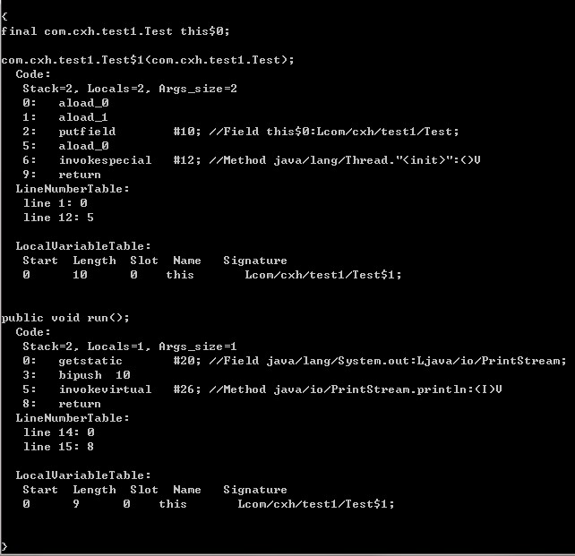
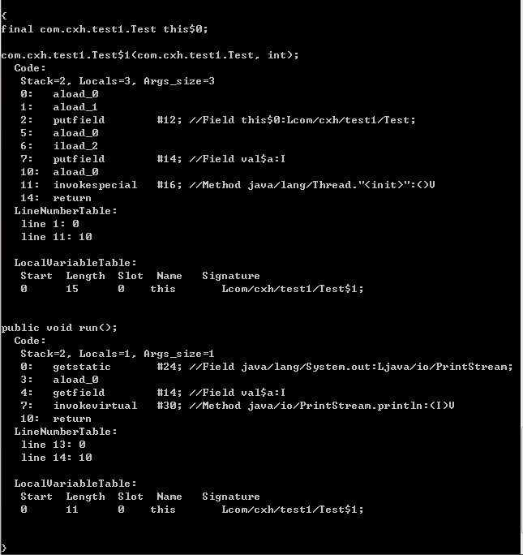

###  为什么局部内部类和匿名内部类只能访问局部final变量？

　　想必这个问题也曾经困扰过很多人，在讨论这个问题之前，先看下面这段代码：

```java
 public class Test {
        public static void main(String[] args) {
        }

        public void test(final int b) {
            final int a = 10;
            new Thread() {
                public void run() {
                    System.out.println(a);
                    System.out.println(b);
                }
                ;
            }.start();
        }
    }
```

　　这段代码会被编译成两个class文件：Test.class和Test1.𝑐𝑙𝑎𝑠𝑠。默认情况下，编译器会为匿名内部类和局部内部类起名为𝑂𝑢𝑡𝑡𝑒𝑟1.class。默认情况下，编译器会为匿名内部类和局部内部类起名为Outterx.class（x为正整数）。

　　

　　根据上图可知，test方法中的匿名内部类的名字被起为 Test$1。

　　上段代码中，如果把变量a和b前面的任一个final去掉，这段代码都编译不过。我们先考虑这样一个问题：

　　当test方法执行完毕之后，变量a的生命周期就结束了，而此时Thread对象的生命周期很可能还没有结束，那么在Thread的run方法中继续访问变量a就变成不可能了，但是又要实现这样的效果，怎么办呢？Java采用了 复制  的手段来解决这个问题。将这段代码的字节码反编译可以得到下面的内容：



　　我们看到在run方法中有一条指令：

```
bipush 10
```

　　这条指令表示将操作数10压栈，表示使用的是一个本地局部变量。这个过程是在编译期间由编译器默认进行，如果这个变量的值在编译期间可以确定，则编译器默认会在匿名内部类（局部内部类）的常量池中添加一个内容相等的字面量或直接将相应的字节码嵌入到执行字节码中。这样一来，匿名内部类使用的变量是另一个局部变量，只不过值和方法中局部变量的值相等，因此和方法中的局部变量完全独立开。

　　下面再看一个例子：

```java
`public` `class` `Test {``    ``public` `static` `void` `main(String[] args)  {``        ` `    ``}``    ` `    ``public` `void` `test(``final` `int` `a) {``        ``new` `Thread(){``            ``public` `void` `run() {``                ``System.out.println(a);``            ``};``        ``}.start();``    ``}``}`
```

　　反编译得到：



　　我们看到匿名内部类Test$1的构造器含有两个参数，一个是指向外部类对象的引用，一个是int型变量，很显然，这里是将变量test方法中的形参a以参数的形式传进来对匿名内部类中的拷贝（变量a的拷贝）进行赋值初始化。

<font color=red size=14>也就说如果局部变量的值在编译期间就可以确定，则直接在匿名内部里面创建一个拷贝。如果局部变量的值无法在编译期间确定，则通过构造器传参的方式来对拷贝进行初始化赋值。从上面可以看出，在run方法中访问的变量a根本就不是test方法中的局部变量a。这样一来就解决了前面所说的 生命周期不一致的问题。但是新的问题又来了，既然在run方法中访问的变量a和test方法中的变量a不是同一个变量，当在run方法中改变变量a的值的话，会出现什么情况？对，会造成数据不一致性，这样就达不到原本的意图和要求。为了解决这个问题，java编译器就限定必须将变量a限制为final变量，不允许对变量a进行更改（对于引用类型的变量，是不允许指向新的对象），这样数据不一致性的问题就得以解决了</font>　　